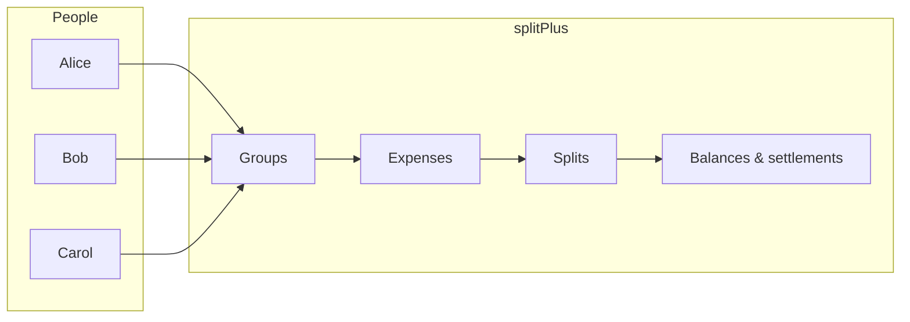
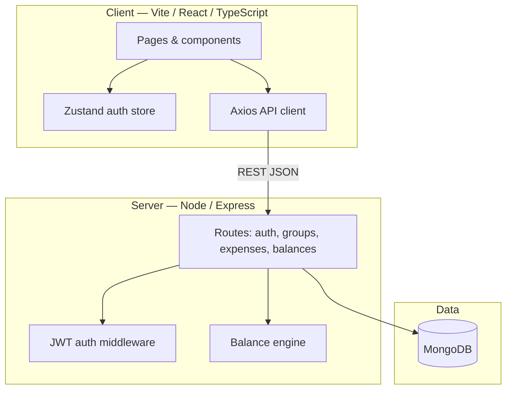
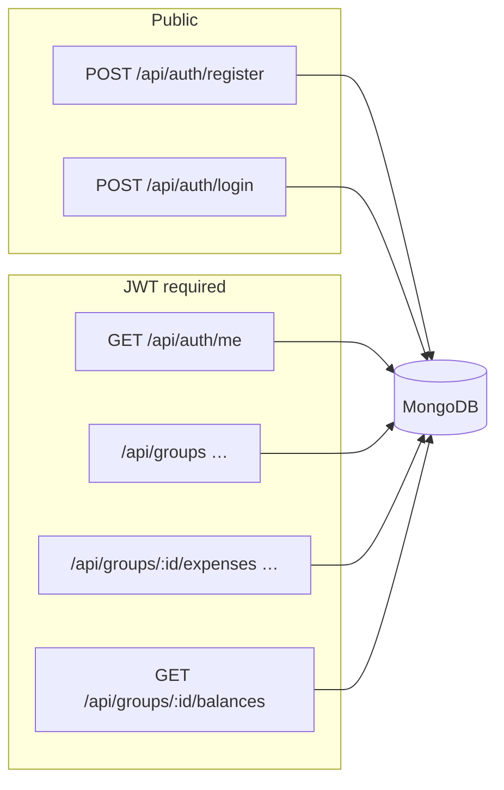
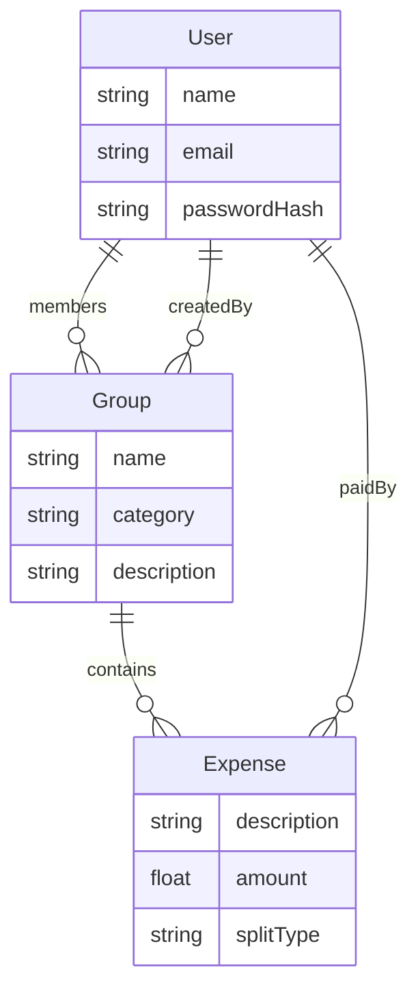
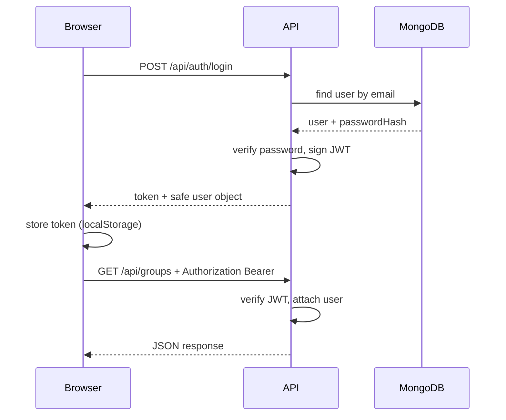
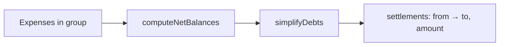

# splitPlus

**splitPlus** is a small bill-splitting app: create **groups** (trips, roommates, meals), log **expenses** with **equal or custom splits**, and see **who owes whom** with simplified settlement suggestions.

---

## Idea

- **Groups** bring people together around shared spending (categories: trip, home, food, other).
- **Expenses** record who paid and how the cost is split across members.
- **Balances** aggregate what each person paid vs. owes; a **balance engine** turns that into a minimal set of “pay X to Y” suggestions so groups can settle up with fewer transfers.



---

## Architecture

Monorepo with a **Vite + React** client and an **Express + MongoDB** API. The browser talks to the API over HTTP with **JWT** in the `Authorization` header; the API enforces membership on group-scoped routes.



### Tech stack

| Layer | Choices |
|--------|---------|
| Frontend | React 18, TypeScript, Vite, Tailwind CSS, React Router, Zustand, Axios, Radix UI |
| Backend | Express, Mongoose, JWT, bcryptjs, express-validator, CORS |
| Database | MongoDB (Atlas or local) |

### API surface (high level)



### Data model (conceptual)

MongoDB stores **users**, **groups**, and **expenses**; each expense embeds **splits** `{ user, share }[]` (not a separate collection).



### Auth flow



### Balances pipeline



---

## Setup guide

### Prerequisites

- **Node.js** (LTS recommended)
- **MongoDB** — local (`mongodb://localhost:27017/...`) or [MongoDB Atlas](https://www.mongodb.com/cloud/atlas)

### 1. Clone and install

```bash
git clone <your-repo-url> splitPlus
cd splitPlus
```

**Server**

```bash
cd server
npm install
cp .env.example .env
```

Edit **`server/.env`**:

| Variable | Purpose |
|----------|---------|
| `PORT` | API port (default **5001**; avoids macOS conflicts on 5000) |
| `MONGO_URI` | MongoDB connection string |
| `JWT_SECRET` | Long random string used to sign tokens |

**Client**

```bash
cd ../client
npm install
```

Optional: create **`client/.env`** if the API is not on the default URL:

```env
VITE_API_URL=http://localhost:5001/api
```

### 2. Run MongoDB (if local)

Example with Homebrew on macOS:

```bash
brew services start mongodb-community@8.0
```

(Or use Docker / Atlas — match `MONGO_URI` in `.env`.)

### 3. Run backend and frontend

**Terminal A — API**

```bash
cd server
npm run dev
```

Health check: [http://localhost:5001/health](http://localhost:5001/health) (or your `PORT`).

**Terminal B — UI**

```bash
cd client
npm run dev
```

Open the URL Vite prints (usually [http://localhost:5173](http://localhost:5173)).

### 4. First use

1. **Register** a user at `/register`.
2. **Login** at `/login`.
3. Create a **group**, add expenses, open the group to see **balances** and suggested **settlements**.

### Production build (client)

```bash
cd client
npm run build
npm run preview   # optional local preview of dist/
```

---

## Repository layout

```
splitPlus/
├── client/          # React SPA (Vite)
├── server/          # Express API
│   ├── src/
│   │   ├── engine/  # Balance / settlement logic
│   │   ├── models/
│   │   ├── routes/
│   │   └── middleware/
│   └── .env.example
└── README.md
```

---

## Security notes

- **Never commit `.env`** — it is listed in `.gitignore`. Use `.env.example` as a template.
- If secrets were ever pushed, **rotate** database credentials and `JWT_SECRET`, and scrub git history if needed.

---

*splitPlus By SK*
